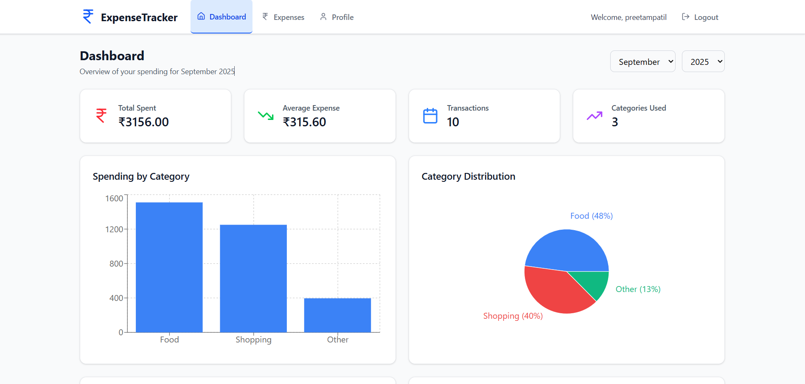
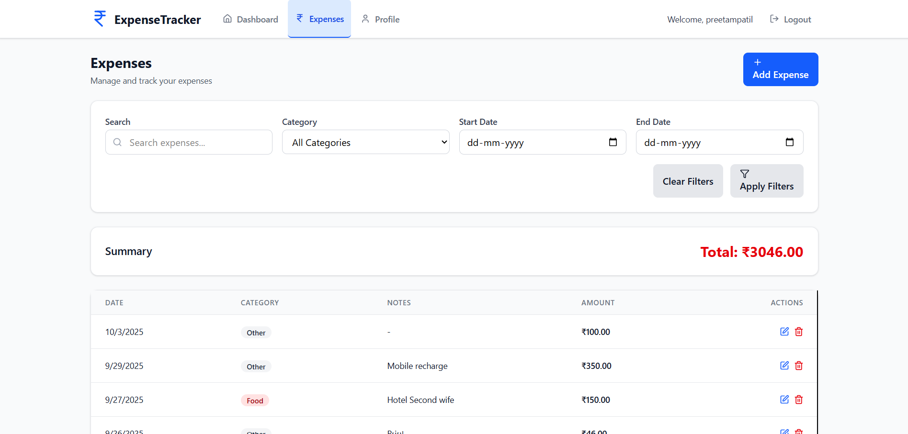
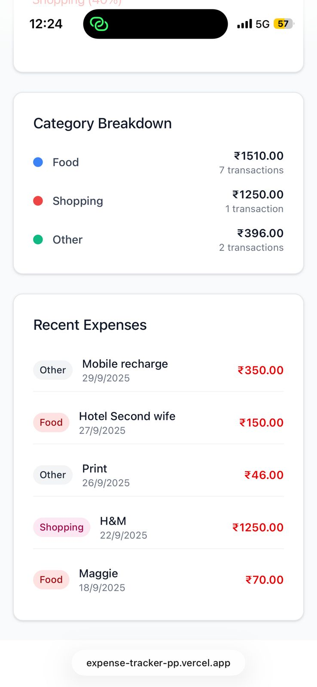

# 💰Expense-tracker — Frontend

A modern, intuitive expense tracker frontend built with **React, Vite, and TailwindCSS**.  
Track your finances beautifully with interactive charts and smooth UI.

---

## ✨ Features

- 📊 **Dashboard Overview** - Visualize your spending with interactive charts  
- 💸 **Expense Management** - Add, edit, and delete expenses with intuitive forms  
- 🗂️ **Smart Categorization** - Organize expenses into 9 predefined categories  
- 📱 **Fully Responsive** - Seamless experience across all devices  
- 📈 **Monthly Analytics** - Filter and analyze expenses by specific time periods  
- 🎯 **Advanced Filtering** - Search by category, date range, and keywords  
- 💰 **Rupee Support** - Built for Indian currency with ₹ symbol  

---

## 🛠️ Tech Stack

### Frontend Architecture

| Technology | Logo | Purpose |
|------------|------|---------|
| **React 18** |  | Modern UI Framework |
| **Vite** |  | Fast Build Tool |
| **TailwindCSS** |  | Utility-First CSS |
| **React Router** |  | Client-Side Routing |

### Frontend Libraries

| Library | Badge | Description |
|---------|-------|-------------|
| **Recharts** |  | Beautiful Data Visualization |
| **Lucide Icons** |  | Beautiful Icon Library |
| **Context API** |  | State Management |

---

## 🧠 Future Enhancements

- ⚡ **Optimized Hosting** – Deploy backend on always-on servers for instant response times  
- 🧾 **Income Management UI** – Add income tracking interface with charts & summary  
- 🤖 **AI Assistant UI** – Integrate AI chatbot to analyze spending & give saving tips  
- 🌗 **Dark Mode Support** – Toggle between light and dark themes for better UX  
- 📈 **Advanced Graphs** – Add trend lines and predictions in analytics dashboard  
- 📲 **PWA Support** – Make HisabKitab installable as a mobile app  
- 🔔 **Notifications** – Frontend reminders for upcoming bills and spending limits  
- 📤 **Export Data** – Download expense reports in PDF/CSV format  

---

